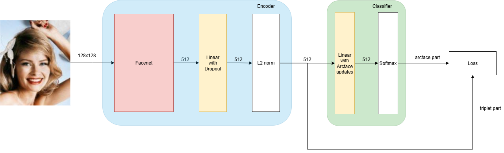
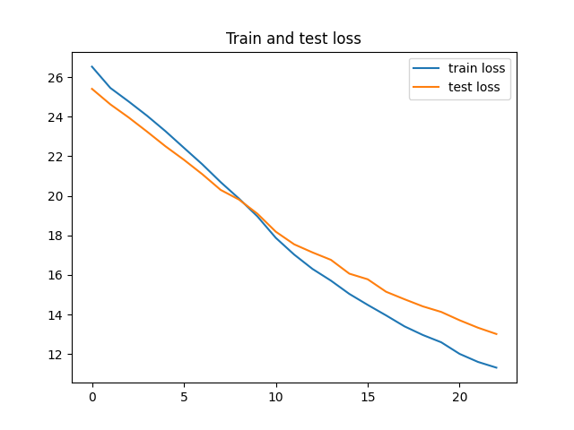
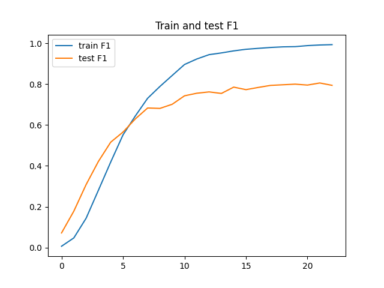
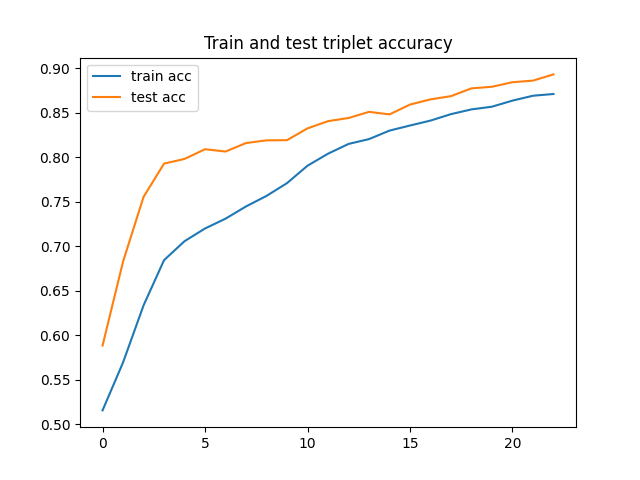

# Распознование лиц с помощью Facenet
## Общая идея
Полный пайплайн будет включать в себя следующие этапы:
1. Детекция лица
2. Выравнивание лица
3. Классификация лица

### Этап 1
Это позволит использовать гораздо больше фотографий для обучения, а также разные датасеты.
### Этап 2
Это ускорит обучение модели засчёт приведения картинок к одному формату, где лицо будет примерно в центре изображения и линия, соединяющая глаза, будет горизонтальной.
### Этап 3
Использована предобученная модель ```Facenet``` на датасете ```vggface2```. Также добавлены изменения в общую архитектуру модели. Модель выглядит так:

Дополнительные линейные слои с dropout не допустили сильного преробучения. Нормализация в свою очередь нужна была для соответсвия формуле ```Arcface loss```. Для лучшего разделения классов был добавлен ```Triplet loss```.  
```Loss = 0.3 ⋅ Triplet + 0.7 ⋅ Arcface```  
Датасет - [celeba 500](https://www.kaggle.com/datasets/wannad1e/celeba-500-label-folders).
Для более быстрой сходимости и из-за небольшого размера датасета, train часть была объединена с validation и модель обучалась на этих данных.

На данный момент реализован 3 пункт пайплайна. Также в планах добавить возможность включения новых лиц и дообучение текущей модели.

## Резльтат обучения



По графикам видно, что модель достигла 80% F1-score на тестовых изображениях.
Готовая модель, которую можно потыкать находится [тут](https://facerecognition-qmrhah7bcdxzgdwvozu4er.streamlit.app/). Для отправки используйте формат изображений ```.jpg```.

## Стек и технологии


